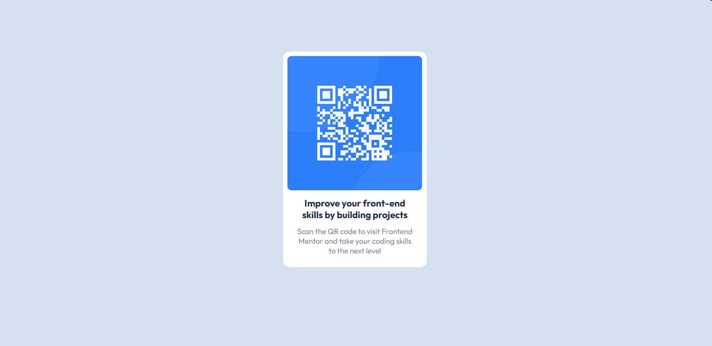

## Table of contents

- [Overview](#overview)
  - [Screenshot](#screenshot)
  - [Links](#links)
- [My process](#my-process)
  - [Built with](#built-with)
  - [What I learned](#what-i-learned)
  - [Continued development](#continued-development)
- [Author](#author)

*

## Overview
This project is a frontend exercise aimed at improving skills in HTML and CSS. It involves creating a QR code component along with accompanying text.

### Screenshot




### Links

- Solution URL: [Add solution URL here](https://your-solution-url.com)
- Live Site URL: [Add live site URL here](https://your-live-site-url.com)

## My process

### Built with

- Semantic HTML5 markup
- CSS custom properties
- CSS Grid
- Desktop-first workflow
- [Styled Components](https://fonts.google.com/) - For fonts


### What I learned
 Below are some key aspects I've learned throughout the development process:

Utilizing Google Fonts for custom font integration.
Implementing responsive design using media queries for various screen sizes.
Positioning elements using CSS properties like transform and position.


```css
@media (max-width:768px){
 
    .container{
        width: 40vw;
       transform: translate(75%,31%);
    }
    
 }
 ```


### Continued development

While I've implemented basic responsiveness in this project, I want to refine my skills in optimizing layouts for a wider range of devices and screen sizes, including large desktop screens and various mobile devices.

I also aim to improve my proficiency in using Git for version control and collaborating with other developers on projects.


## Author

- Frontend Mentor - [@bolanlesadela](https://www.frontendmentor.io/profile/bolanlesadela)

